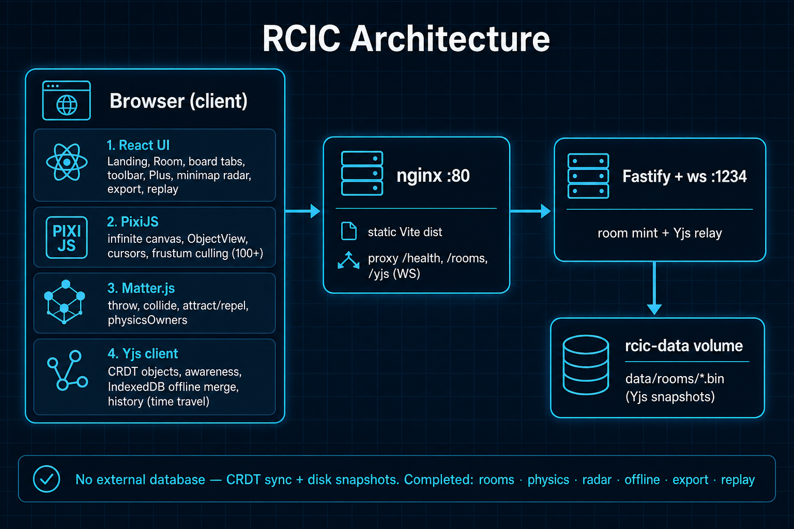

# RC-board

Real-time collaborative infinite canvas — rooms, shapes, physics, offline sync, and session replay.

**RC-board** — AI-powered online whiteboard where ideas and teams connect.

## CanvasOps (micro1 Frontier / Agentic Workflows 2026)

Hackathon entry: agentic post-brainstorm structuring on top of RCIC.

- **Docs:** [docs/hackathon/README.md](docs/hackathon/README.md)
- **Eval:** `npm run canvasops:eval` → `evals/out/report.json`
- **Pre-challenge substrate tag:** `pre-challenge-rcic`

Primary result (deterministic, no API keys): advanced task success **1.000** vs baseline **0.083** on 12 synthetic fixtures.



## Deploy on Firebase (Hosting + Cloud Run)

The UI is served by **Firebase Hosting**. The Yjs WebSocket sync server runs on **Cloud Run** (Hosting alone cannot keep long-lived sockets). Room snapshots go to **Cloud Storage** when `GCS_BUCKET` is set.

**Project:** `quiz-manager-f9c45` · **Region:** `europe-west1` · **URL:** https://quiz-manager-f9c45.web.app

### One-time setup

1. Install [Google Cloud SDK](https://cloud.google.com/sdk/docs/install) (required for `npm run deploy:server`) and log in.

On Windows (PowerShell):

```powershell
winget install -e --id Google.CloudSDK
# Close this terminal and open a new one so PATH picks up gcloud
gcloud auth login
gcloud config set project quiz-manager-f9c45
firebase login
```

2. Enable APIs and create the snapshot bucket:

```bash
gcloud services enable run.googleapis.com cloudbuild.googleapis.com artifactregistry.googleapis.com storage.googleapis.com

gcloud storage buckets create gs://quiz-manager-f9c45-rcic-rooms \
  --project=quiz-manager-f9c45 \
  --location=europe-west1
```

3. Grant the Cloud Run runtime service account access to the bucket (replace `PROJECT_NUMBER` from `gcloud projects describe quiz-manager-f9c45 --format="value(projectNumber)"`):

```bash
gcloud storage buckets add-iam-policy-binding gs://quiz-manager-f9c45-rcic-rooms \
  --member="serviceAccount:PROJECT_NUMBER-compute@developer.gserviceaccount.com" \
  --role="roles/storage.objectAdmin"
```

### Deploy

```bash
npm install
npm run deploy:server    # Cloud Run: rcic-server (max 1 instance)
npm run deploy:hosting   # build Vite app + firebase deploy --only hosting
# or: npm run deploy     # server then hosting
```

Hosting rewrites `/health`, `/rooms`, and `/yjs/**` to Cloud Run, so the client keeps same-origin API/WS URLs (no `VITE_*` required for production).

| | |
|---|---|
| Change Firebase project | edit [`.firebaserc`](.firebaserc) |
| Override bucket / region | `GCS_BUCKET`, `CLOUD_RUN_REGION`, `GCLOUD_PROJECT` when running `deploy:server` |

Cloud Run uses **`--max-instances=1`** so all peers share one Yjs process. Scaling out needs a shared pub/sub layer (not included).

---

## Quick start (Docker)

1. Install and start [Docker Desktop](https://www.docker.com/get-docker/).
2. From the project root:

```bash
docker compose up --build
```

3. Open **http://localhost**

Create a board, share the URL, collaborate live.

| | |
|---|---|
| Stop | `Ctrl+C` or `docker compose down` |
| Wipe saved boards | `docker compose down -v` |
| Health check | `curl http://localhost/health` → `{"ok":true}` |

Snapshots are stored in the `rcic-data` volume (local filesystem). The UI is on port **80**; the sync server is also available on **1234**.

---

## Local development (optional)

Use this if you are changing code and want hot reload.

```bash
npm install
npm run dev
```

Open **http://localhost:5173** (API/Yjs on **:1234**; Vite proxies `/health`, `/rooms`, `/yjs`).

```bash
npm run typecheck
npm run build
```

---

## Tests

```bash
npm test              # unit + offline CRDT race
npm run test:race     # + live WebSocket race
npm run test:load     # 20-client load / p95 sync budget
npm run test:all      # everything Vitest covers
```

Smoke test (needs a running server — Docker or `npm run dev`):

```bash
npm run test:smoke

# Through the Docker nginx proxy:
#   PowerShell:  $env:SMOKE_WS_URL="ws://localhost/yjs"; npm run test:smoke
#   bash:        SMOKE_WS_URL=ws://localhost/yjs npm run test:smoke
```

---

## What you can do

- Live rooms with invite links and in-app board tabs
- Text, shapes, stickies, images, audio, ink (marker), connectors, comments, sections
- Code snippets, polls, tables, charts, stickers, voting, reactions, templates
- Hand tool (pan), rotate, physics (throw / attract / repel)
- Mini-map radar for peer viewports; offline edits via IndexedDB (merge on reconnect)
- Export PNG / SVG / JSON; session replay (time travel)

The architecture diagram above reflects the completed client + sync + Docker solution.

## Project layout

```
apps/web           React + Pixi client (nginx in Docker / Firebase Hosting)
apps/server        Fastify + Yjs WebSocket relay (Cloud Run)
packages/shared    Shared types
tests/             Race and load tests
docs/              Architecture, issues, standards
firebase.json      Hosting + Cloud Run rewrites
docker-compose.yml
```

## Stack

React · Vite · PixiJS · Matter.js · Yjs · Fastify · Docker · Firebase Hosting · Cloud Run · Cloud Storage

Persistence: **Yjs snapshots** — local `data/rooms/*.bin` (Docker) or **GCS** when `GCS_BUCKET` is set. No SQL database.

## Docs

- [Architecture diagram](docs/architecture.jpg)
- [AI & collaboration roadmap](docs/AI_ROADMAP.md)
- [Issues & fixes](ISSUES.md)
- [Coding standards](CODING_STANDARDS.md)

### Optional env vars

| Variable | Default | Purpose |
|----------|---------|---------|
| `PORT` | `1234` (local) / Cloud Run sets `8080` | Server listen port |
| `DATA_DIR` | `./data/rooms` | Local snapshot directory |
| `GCS_BUCKET` | unset | If set, snapshots go to this Cloud Storage bucket |
| `VITE_API_URL` | same origin | HTTP API base (build-time) |
| `VITE_WS_URL` | `ws(s)://host/yjs` | Yjs WebSocket base (build-time) |
| `SMOKE_WS_URL` | `ws://localhost:1234/yjs` | Smoke-test endpoint |
